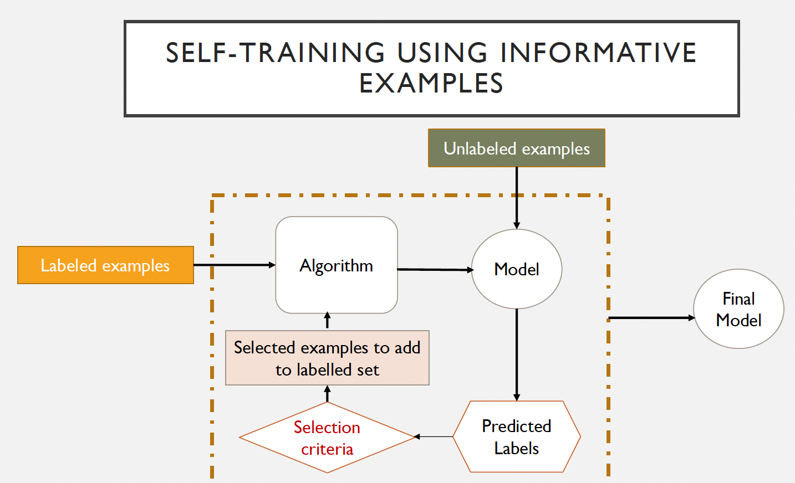
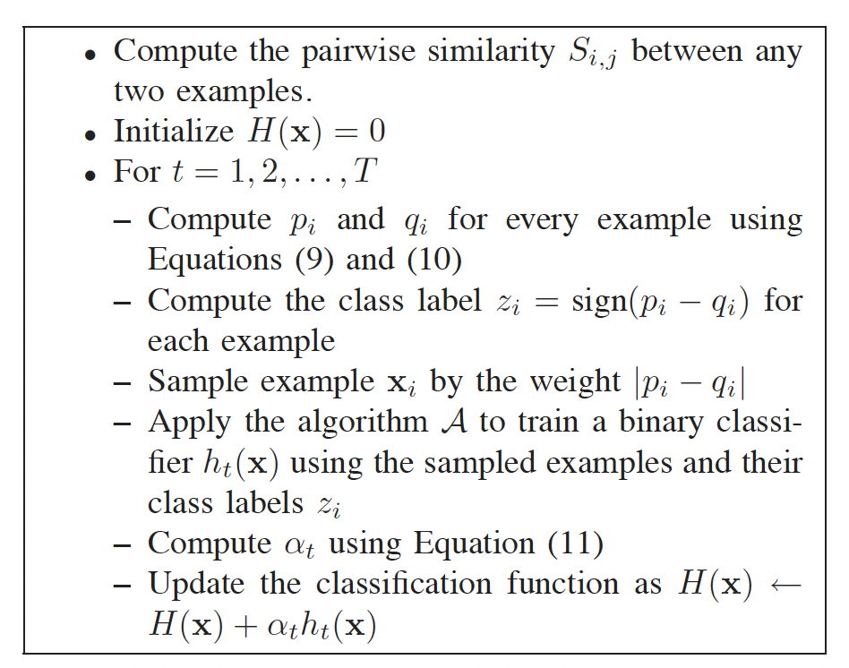
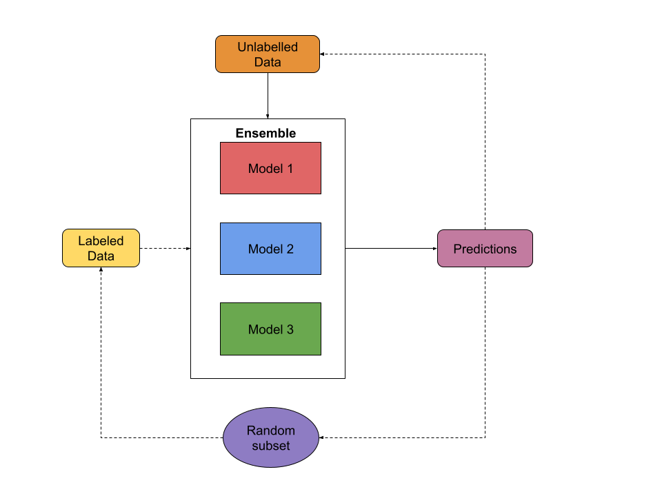
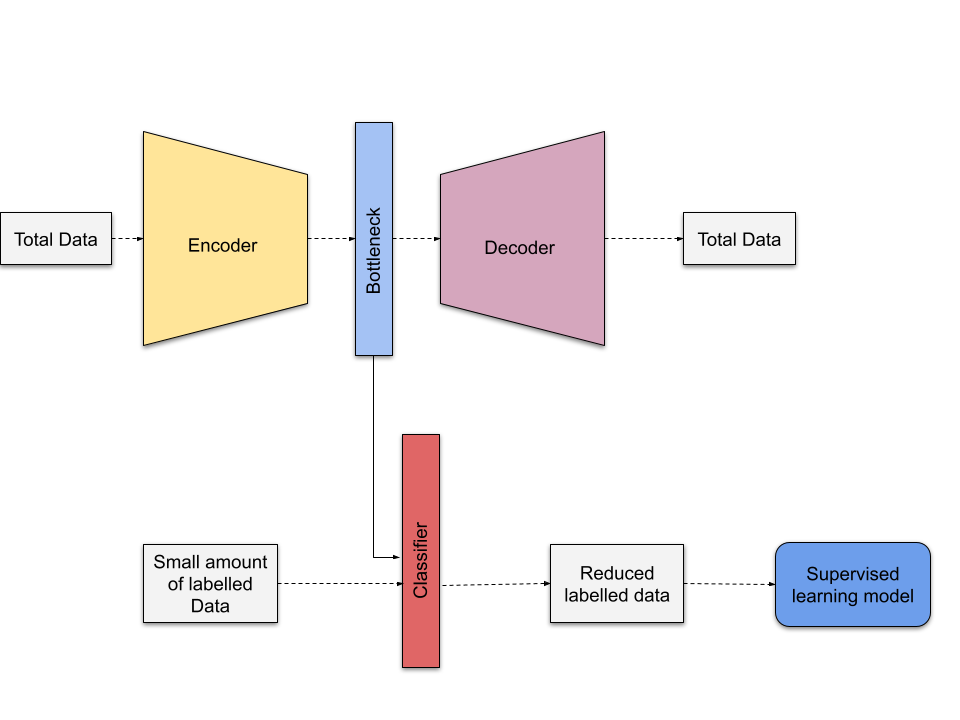

# Exploratory-Semi-supervised-Learning

## Abstract
In this project I evaluate and compare different methods of Semi-supervised learning on three different datasets. For the evaluation I record the Accuracy, F1-score,
Running Time and the ROC plot for each algorithm on different percentages of unlabelled data. Since the datasets are completely labelled, I use the fully labelled
data as a baseline for the different semi-supervised algorithms, then I unlabelled some percentage of the labelled data and evaluate the performance of the algorithms
again. I do this for 10%, 20%, 50%, 90% and 95% unlabelled data and record the performance of the algorithms on the same.

## Datasets 
3 datasets were used in this experiment

#### 1. Online Shoppers Purchasing Intention Dataset Data Set
From Sakar, C.O., Polat, S.O., Katircioglu, M. et al. Neural Comput & Applic (2018).<br>
Dataset Location -> https://archive.ics.uci.edu/ml/datasets/Online+Shoppers+Purchasing+Intention+Dataset

#### 2. Customer Personality Analysis
Dataset Location -> https://www.kaggle.com/imakash3011/customer-personality-analysis/version/1

#### 3. Heart Disease UCI
Dataset Location -> https://www.kaggle.com/ronitf/heart-disease-uci

## Semi-supervised Algorithms Used
#### Self-Training<br> 
<br>
#### Semi-Boost<br>
<br>
<i>SemiBoost Boosting for Semi supervised Learning</i>: Pavan Kumar Mallapragada, Student Member, IEEE, Rong Jin, Member, IEEE, Anil K. Jain, Fellow, IEEE, and Yi Liu, Student Member, IEEE
[Reference->https://github.com/papabloblo/semi_boost/tree/master/src]
#### Majority Voting Classifier<br>

<i>Ensemble Learning with Voting Aggregation for Semi-supervised Classification Tasks</i>: Matheus Alves; Ana L. C. Bazzan; Mariana Recamonde-Mendoza
- Unsupervised Preprocessing Using Autoencoders



## Requirements
The requirements for this project are given in the requirements.txt file, to install the requirements run the below command:
```
pip install -r requirements.txt
```
